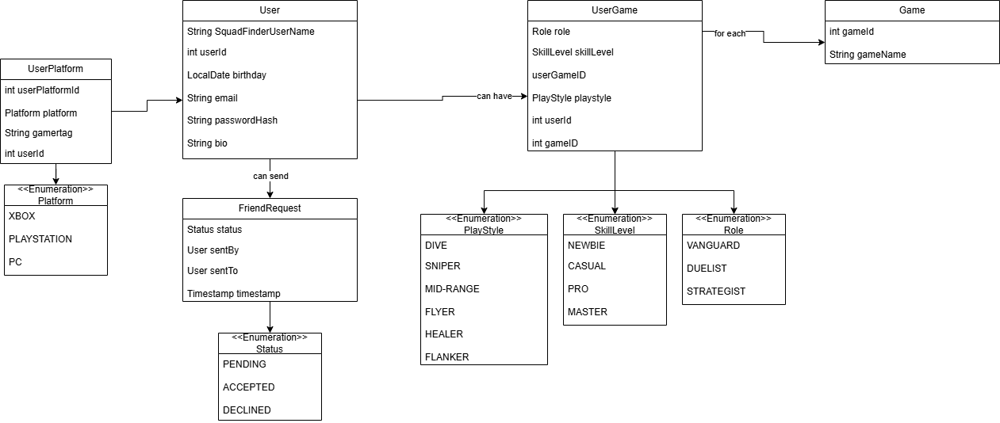
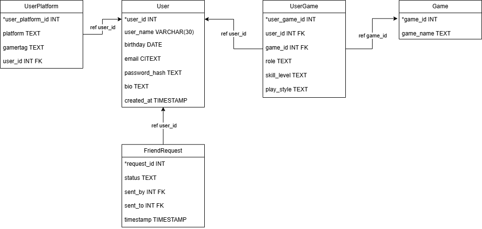

# Project Overview
## 1) Concept
SquadFind is a web-based application specifically targeted towards gamers who play
games with multiplayer functionality. The main purpose is to allow for these gamers 
to find players who have a similar interest in different aspects of gaming in a streamlined
and intuitive way. This is achieved through recommendations based on given user data, as well
as a fine-tuned search option that allows players to search for friends based on their provided
criteria. When a player finds someone who they may be interested in squadding up with, they can
send out a friend request. An accepted friend request will allow these players to connect and squad up.

## 2) What the User Provides
### 2a) Everything that assists users in finding a squad member:
- Gamertag.
- Their prospective gaming platforms.
- Games interested in.
- What their skill level is for each game (NEWBIE, CASUAL, PRO, MASTER).
- Roles they play as (e.g. VANGUARD, DUELIST, STRATEGIST).
### 2b) Additional Profile information gathered:
- SquadFinderID (username for the web application).
- Email
- Bio
- Birthday

## 3) MVP
The MVP of this project aims to capture the core functionality of the application, while
focused on a specific subset of games. The specific subset of games used for this MVP will be
Marvel Rivals and Overwatch (hero shooters). Under this MVP, a user should be able to accomplish
the following:
- Create an account.
- Personalize their bio.
- Enter their gamertag.
- Enter their prospective platforms.
- Enter whether they play Marvel Rivals, Overwatch, or both.
- Select their skill level for the game (with info boxes next to each skill level).
- Select the role they typically play.
- Select their favored playstyle.
- Access a dashboard that shows potential users they may want to squad up with, based on provided info.
- Search for users based on specific criteria.
- Send a friend request.
- Accept a friend request.
### 3a) Domain Diagram and Design decisions

As seen above, the core objects consist of a User, Game, UserPlatform, UserGame, Game, and FriendRequest.
The choice to have separate objects for UserPlatform and UserGame boiled down to DB schema considerations and entity relationships.
A user can have multiple accounts on multiple platforms, thus tying the username to the user and to a platform. The
UserPlatform object models the real-world relationship and ensures that a user only needs to enter their username for each
platform once, and any game that is played on that platform will automatically be tied to the respective username. UserGame
also mimics the real-world relationship between a User and the Game they play.
Enumerations will be used for specific class attributes. 

## 4) Beyond MVP
The scope of the finalized project reaches beyond the functionality stated in the MVP. Features that will comprise
the final product include the following:
- Compatability with any multiplayer/co-op game.
- Roles and playstyles tailored to specific games.
- Chat functionality between users.
- Time that a user is typically on.
- Deep personalization (user themes, profile picture).

## 5) Tech Stack
This project is being done with the following technologies:
- Java
- Maven
- SpringBoot
- Spring Security + JWT
- PostgresSQL
- React (Typescript)
- Git/GitHub
### 5a) Rationale
Java/SpringBoot is the language of choice for this project due to its business logic capabilities
and its prominence in backend of web applications. Maven allows for managing dependencies
and builds. Spring Security and JWT are in charge of handling authentication and password
hashing, as well as token based auth. PostgreSQL is the database of choice due to its robustness
and prominence in industry. React with Typescript ensures a smooth user experience through the UI
as well as having strong type safety. Git will be the tool for version control.
## 6) Database Schema

Pictured above is the database schema that will be constructed utilizing PostgreSQL. Primary keys are
denoted with an asterisk before the name of the column. Foreign keys are denoted with FK written after the 
columns data type. What these foreign keys reference is written on the arrow that connects one table to another.
The DB schema is completely derived from the domain model. An update to the overall design was done with this
schema, adding a created_at column for the user table. This is not currently reflected in the domain diagram, but 
will eventually be updated.
### Database Tables
- Users
- UserPlatform (refs. Users user_id)
- UserGame (refs. Users user_id & Game game_id)
- Game
- FriendRequest (refs. Users user_id)
## 7) Overall Design Architecture
This project utilizes the Controller-Service-Repository design architecture. This was chosen due to the patterns
excellent ability to allow for separation of concerns, allowing code to be more maintainable, readable, scalable, and
testable. HTTP requests are handled through the Controller layer (e.g. UserController), which are then routed to 
the Service layer, which handles the business logic operations of the application. The Service layer manipulates the 
data that is present in the database, which the Repository layer is responsible for communicating with, and data is 
persisted throughout sessions.
## 8) API Endpoints
### Format: Method | Path | Description | Request Body | Response
#### Authentication
POST | /api/auth/register | Registers new user | username, email, password, birthday | 201, userId
POST | api/auth/login | Logs a user in | username, password | 200, JWT token
#### User Profile
GET | /api/users/{id} | Gets a users profile | N/A | 200, user object
PUT | /api/users/{id} | Updates a users profile | bio | 200, updated user
DELETE | /api/users/{id} | Deletes a users profile | N/A | 204 
#### User Platform
POST | /api/users/{id}/platforms | add a platform and gamertag | platform, gamertag | 201, userPlatformId
DELETE | /api/users/{id}/platforms | delete a platform | platform | 204
#### User Games
POST | /api/users/{id}/games | add a game to a users profile | gameId, role, skill, playstyle | 201, userGameId
PUT | /api/users/{id}/games/{userGameId} | update role, skill, playstyle info | gameId, role, skill, playstyle | 200, updated game info
DELETE | /api/users/{id}games/{userGameId} | deletes game and game info from user | N/A | 204
#### Discover Players
GET | /api/discover | get users based on logged in users games and platforms | N/A | 200, list of users
GET | /api/discover/search?game=X&platform=Y&role=Z | get users based on search criteria | N/A| 200, list of users
#### Friend Requests
POST | /api/friends/request | send a friend request | userId (sent by), userId (sent to), timestamp | 201, requestId
PUT | /api/friends/request/{requestId}/accept | accept a friend request | requestId | 200, updated friendRequest object
PUT | /api/friends/request/{requestId}/decline | decline a friend request | requestId | 200, updated friendRequest object
GET | /api/friends/request/incoming | view incoming friend requests | N/A | 200, list of requests
GET | /api/friends/request/outgoing | view outgoing friend requests | N/A | 200, list of requests
GET | /api/friends | view users connected friends | N/A | 200, list of users
